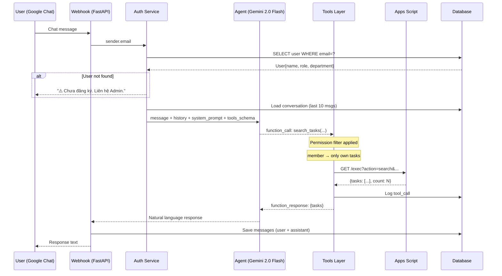
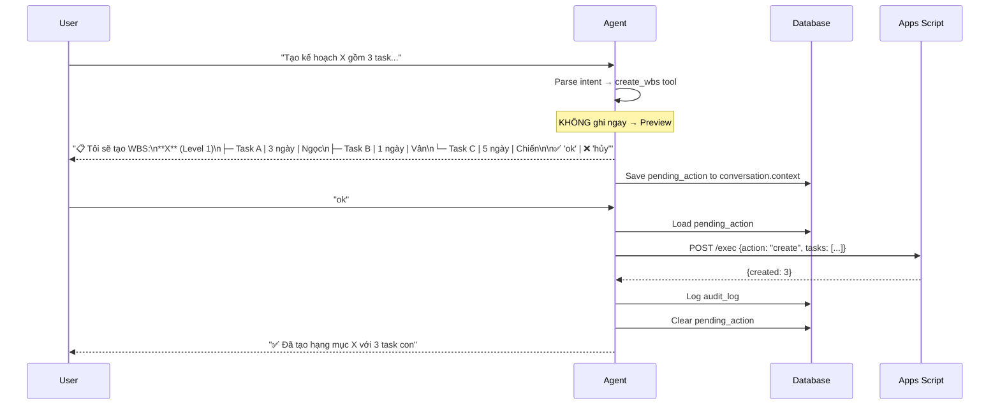
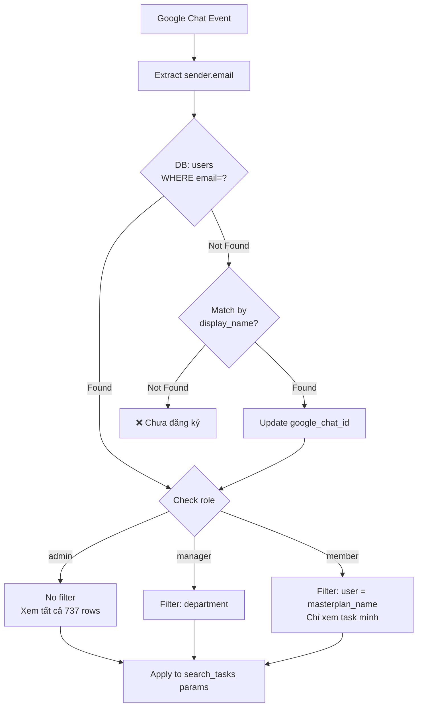
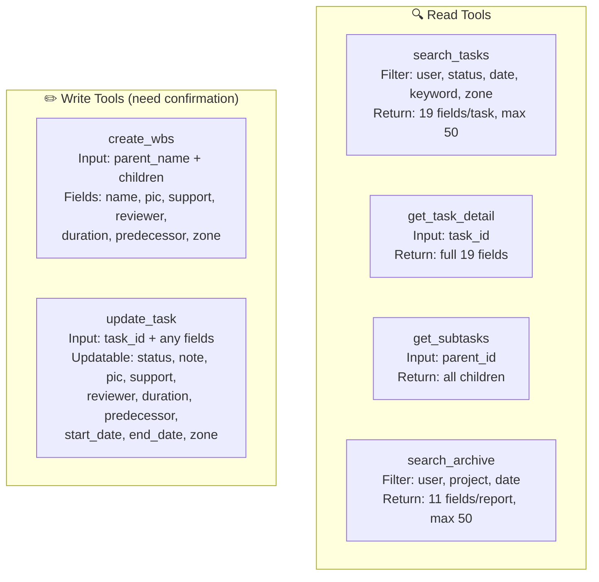
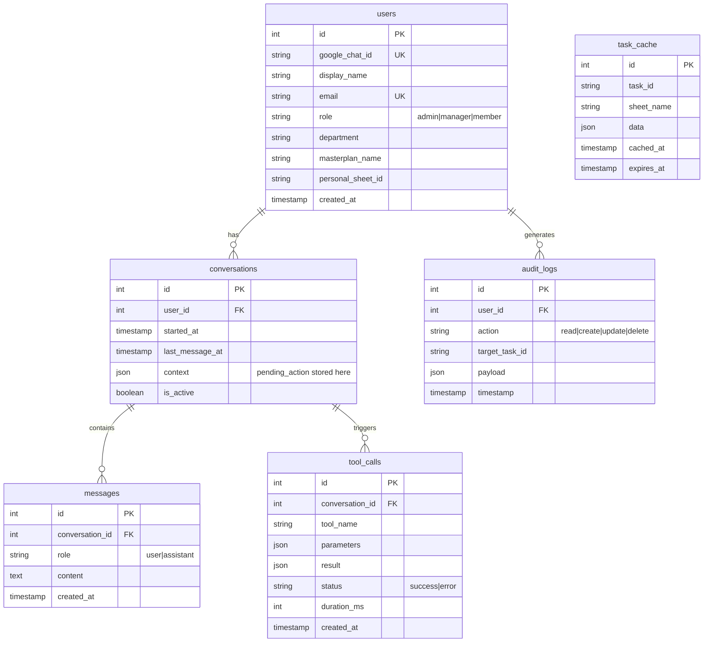
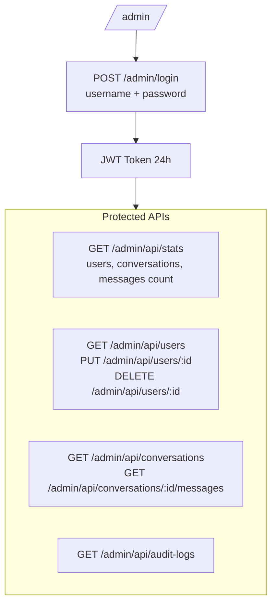
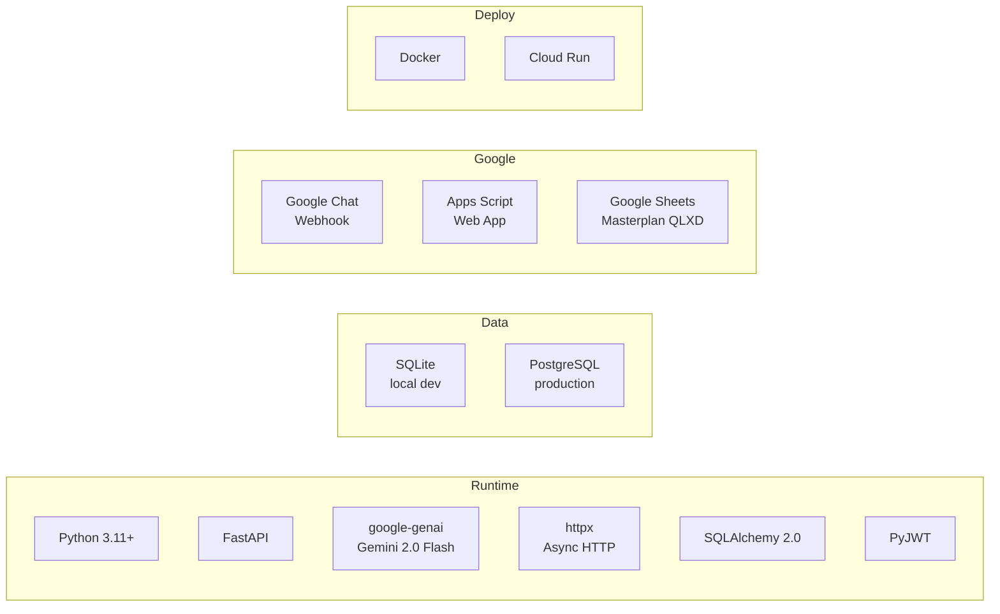

# BHI AI Agent - Pipeline Architecture

## 1. System Architecture

```mermaid
flowchart LR
    subgraph Frontend
        GC[Google Chat\n18 users BHI]
    end

    subgraph Backend["Python Backend (FastAPI + Cloud Run)"]
        WH[Webhook\n/api/google-chat]
        AUTH[Auth Service\nemail → user mapping]
        AGENT[Agent Service\nGemini 2.0 Flash\nFunction Calling]
        TOOLS[Tools Layer\n6 tools]
    end

    subgraph DB["PostgreSQL / SQLite"]
        USERS[(users\n18 records)]
        CONV[(conversations)]
        MSG[(messages)]
        TC[(tool_calls)]
        CACHE[(task_cache)]
        AUDIT[(audit_logs)]
    end

    subgraph Sheets["Google Sheets"]
        GAS[Apps Script\nWeb App API]
        KH[KẾ HOẠCH\n737 rows × 19 cols]
        AR[_ARCHIVE_LOG\n4016 rows × 11 cols]
        NS[Danh sách nhân sự\n18 người]
    end

    subgraph Admin["Admin Dashboard"]
        DASH[/admin/\nJWT Auth]
    end

    GC -->|chat message| WH
    WH --> AUTH
    AUTH -->|lookup| USERS
    AUTH --> AGENT
    AGENT -->|function calling| TOOLS
    TOOLS -->|HTTP GET/POST| GAS
    GAS -->|read/write| KH
    GAS -->|read| AR
    GAS -->|read| NS
    AGENT -->|save| CONV
    AGENT -->|save| MSG
    TOOLS -->|log| TC
    TOOLS -->|cache| CACHE
    TOOLS -->|audit| AUDIT
    AGENT -->|response| GC
    DASH -->|JWT protected| DB
```

## 2. Message Processing Flow



## 3. Write Operation (Confirmation Flow)



## 4. Authentication & Authorization



## 5. Tools Available (6 tools)



## 6. Data Schema



## 7. Admin Dashboard



## 8. Tech Stack


